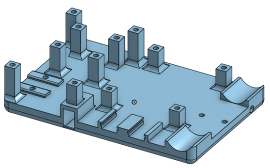
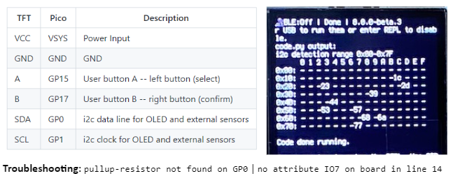
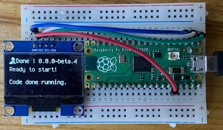
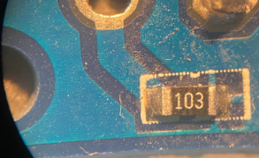
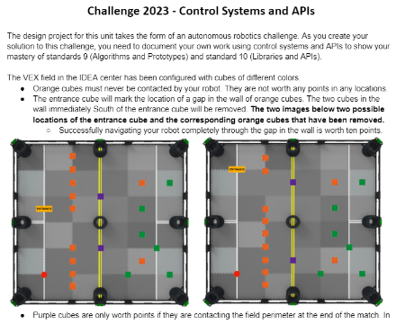

# Control Algorithms and APIs
Control Algorithms and APIs

### Carrier board for MCU, oled and power supply on RVR Sphero

### The I2C bus

### Connect and drive the oled display

### Control Simulations

- [ball heater](https://editor.p5js.org/emwdx/sketches/vZxxr7lmn)
- [motorized arm](https://editor.p5js.org/emwdx/sketches/7djf_KfSD)

### Pulldown resistor - logic states in physical voltages

### RVR Challenge

